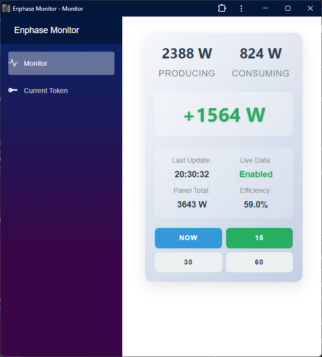

# Enphase Monitor

A cross-platform application for real-time monitoring of Enphase solar panel systems, built with .NET MAUI and Blazor WebAssembly.



## Overview

Enphase Monitor provides a modern GUI interface for monitoring solar energy production and consumption in real-time. It serves as the successor to a previous console-based application, offering enhanced visualization and cross-platform compatibility.

## Features

### 🔋 Real-Time Energy Monitoring
- **Live Production Data**: Current solar panel energy generation
- **Consumption Tracking**: Real-time household energy usage
- **Net Energy Flow**: Instant calculation of surplus/deficit
- **Configurable Refresh**: 15, 30, or 60-second update intervals

### 📱 Cross-Platform Support
- **Windows Desktop**: Native MAUI application
- **Android Mobile**: APK installation with secure token storage
- **Web Browser**: Responsive web application
- **Progressive Web App**: Installable PWA with offline functionality

### 🔐 Secure Token Management
- **Cross-Platform Sharing**: Copy tokens between devices
- **Secure Storage**: Platform-specific encryption (SecureStorage/localStorage)
- **OAuth Integration**: Separate token acquisition workflow
- **One-Time Setup**: Token persists across app launches

### 🎨 Professional Design
- **Ultra-Responsive**: Scales from desktop monitors to 60px width
- **Custom Branding**: Professional icons and consistent naming
- **Offline Capable**: PWA works without internet connection
- **Modern UI**: Bootstrap-based responsive design

## Architecture

```
┌─────────────────┐    ┌──────────────────┐    ┌─────────────────┐
│   MAUI App      │    │  Blazor WASM     │    │ OAuth Web App   │
│ (Cross-Platform)│    │     (PWA)        │    │ (Token Manager) │
└─────────────────┘    └──────────────────┘    └─────────────────┘
         │                       │                       │
         ▼                       ▼                       ▼
┌─────────────────┐    ┌──────────────────┐    ┌─────────────────┐
│  envoy.local    │    │ CORS Proxy       │    │ Enphase Cloud   │
│ (Local Device)  │    │ (Web Bridge)     │    │ OAuth APIs      │
└─────────────────┘    └──────────────────┘    └─────────────────┘
```

### Project Structure
- **MauiEnphaseMonitor**: Cross-platform MAUI Blazor Hybrid app
- **MauiEnphaseMonitor.Wasm**: Progressive Web App for browser installation
- **MauiEnphaseMonitor.OAuth**: Dedicated OAuth token acquisition service
- **MauiEnphaseMonitor.CorsProxy.Console**: Local CORS proxy for web browser `envoy.local` access
- **MauiEnphaseMonitor.Shared**: Common UI components and business logic

## Getting Started

### Prerequisites
- .NET 9 SDK
- Visual Studio 2022 (for MAUI development)
- Enphase Envoy device on local network
- Valid Enphase developer account (for token acquisition)

### Installation

#### Option 1: MAUI Desktop/Mobile App
1. Clone the repository
2. Open `MauiEnphaseMonitor.sln` in Visual Studio
3. Set `MauiEnphaseMonitor` as startup project
4. Build and run for Windows or Android

#### Option 2: Progressive Web App
1. Set `MauiEnphaseMonitor.Wasm` as startup project
2. Run the web application
3. Install as PWA using browser's install prompt
4. Access offline functionality after installation

#### Option 3: Web Browser (requires CORS proxy)
1. **Start CORS Proxy**: Run `MauiEnphaseMonitor.CorsProxy.Console` project locally
2. **Navigate to Web App**: Open the hosted web application  
3. **Initialize Proxy**: Web app will automatically configure proxy with your token
4. **Use Directly**: Monitor energy data in browser without installation

#### Option 4: Progressive Web App (requires CORS proxy)
1. **Start CORS Proxy**: Run `MauiEnphaseMonitor.CorsProxy.Console` project locally
2. **Install PWA**: Use browser's install prompt to install as standalone app
3. **Token Setup**: Configure proxy with authentication token
4. **Offline Access**: PWA works offline after initial setup

### Token Setup
1. **Get Token**: Run `MauiEnphaseMonitor.OAuth` project to authenticate with Enphase
2. **Copy Token**: Use the OAuth app's clipboard functionality
3. **Paste Token**: Enter token in any platform's "Current Token" page
4. **Share Across Devices**: Use "Copy Token" button to share between platforms

## Usage

### Initial Setup
1. **Token Acquisition**: Use OAuth app to get authentication token
2. **Token Storage**: Paste token into monitoring app's token page
3. **Verification**: App will validate token and show connection status

### Monitoring Dashboard
- **Current Values**: See real-time production and consumption
- **Net Energy**: Central display shows energy surplus/deficit
- **Refresh Controls**: Choose update frequency (15s, 30s, 60s, or manual)
- **Status Information**: Connection status and last update time

### Cross-Platform Workflow
1. **Primary Setup**: Get token on one device/platform
2. **Token Sharing**: Copy token from primary device
3. **Secondary Setup**: Paste token on additional devices
4. **Independent Operation**: Each platform stores token locally

## Platform-Specific Features

### Windows (MAUI)
- ✅ Native desktop application
- ✅ Direct `envoy.local` API access
- ✅ System tray integration potential
- ✅ Custom window icons and branding

### Android (MAUI)
- ✅ APK installation
- ✅ Secure token storage via SecureStorage
- ✅ Network security configuration for local device access
- ⚠️ Real devices only (emulators cannot access local network)

### Web Browser
- ✅ Responsive design for all screen sizes
- ✅ Real-time monitoring dashboard
- ✅ Cross-platform token sharing
- ⚠️ Requires CORS proxy (console app) for `envoy.local` access

### Progressive Web App
- ✅ Complete offline functionality
- ✅ Desktop/mobile installation
- ✅ Service worker with comprehensive caching
- ✅ Native app-like experience
- ⚠️ Requires CORS proxy (console app) for `envoy.local` access
- ⚠️ Firefox desktop has limited PWA support

## Browser Compatibility

| Browser | Web App | PWA Install | Notes |
|---------|---------|-------------|-------|
| Chrome | ✅ Full | ✅ Full | Complete PWA support |
| Edge | ✅ Full | ✅ Full | Complete PWA support |
| Firefox | ✅ Full | ⚠️ Limited | Desktop install rarely available |
| Safari | ✅ Full | ✅ Mobile | iOS "Add to Home Screen" |

## Known Limitations

### Network Access
- **Android Emulators**: Cannot access `envoy.local` due to network isolation
- **Web CORS**: Browsers require CORS proxy console app for local device API calls
- **Local Network Only**: Enphase device must be on same network

### Browser-Specific
- **Firefox PWA**: Limited desktop installation support (browser limitation)
- **Safari**: PWA features vary between macOS and iOS versions

### Development
- **WSL/Linux**: Cannot build MAUI projects with mobile targets
- **Hot Reload**: Disabled in PWA for consistent offline behavior

## Development Setup

### Build Requirements
- Windows 10/11 (for MAUI development)
- Visual Studio 2022 with MAUI workload
- Android SDK (for Android builds)
- Node.js (for web development tools)

### Project Configuration
- **MAUI**: Targets Windows, Android, iOS, MacCatalyst
- **WASM**: Standalone PWA with offline capabilities
- **Shared Library**: Common components and business logic
- **OAuth App**: Server-side Blazor for token acquisition

### Development Workflow
1. **MAUI Development**: Use Visual Studio on Windows
2. **Web Development**: Can use WSL/Linux for web-only projects
3. **Testing**: Real Android devices required for local network testing
4. **PWA Testing**: Use Ctrl+F5 for hard refresh (service worker caching)

## License

This project is licensed under the MIT License - see the LICENSE file for details.

## Acknowledgments

- Built with .NET MAUI and Blazor WebAssembly
- Enphase Energy for local device API access
- Bootstrap for responsive UI components
- Progressive Web App standards for offline functionality

---

**Enphase Monitor** - Professional solar energy monitoring across all your devices.